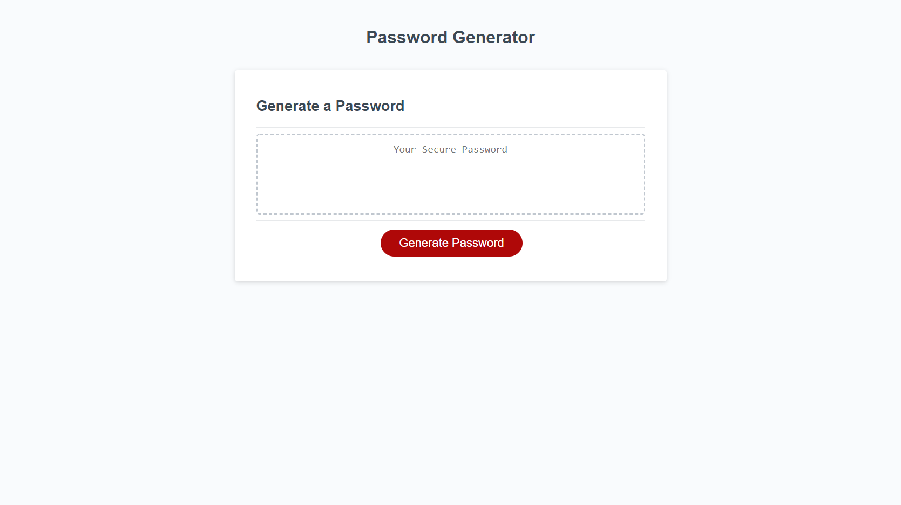

# Random-Password-Generator
This webpage will allow the user to generate a random, secure password that contains at least 8 characters and no more than 128 characters. When prompted, the user will be asked questions to decide whether or not the password should contain lowercase, uppercase, numeric, and/or special characters. User must choose at least one character type to generate a password. 

## Links 

https://github.com/ycheng2021/Random-Password-Generator

https://ycheng2021.github.io/Random-Password-Generator/

